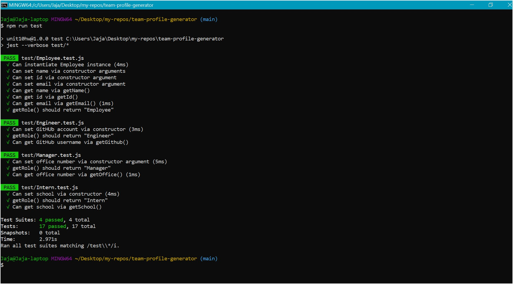
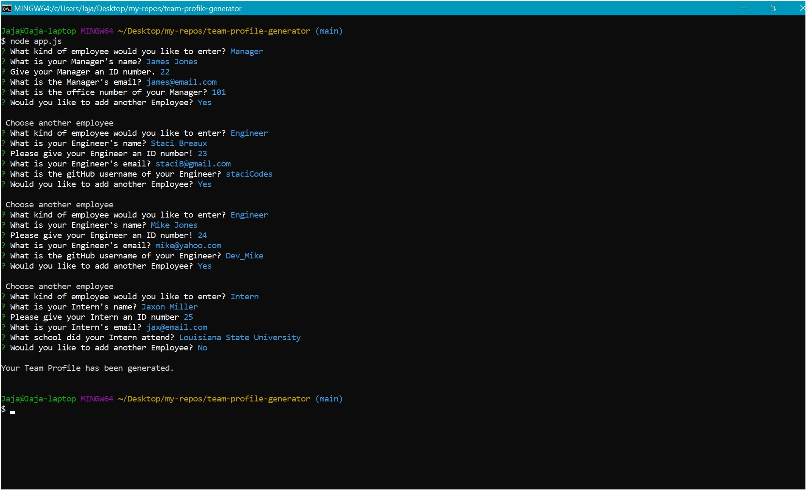

# team-profile-generator

## Description

This CLI application that creates a Team Profile page based on user input. It is run through the command line using Nodejs and a package named Inquirer to prompt the user. That input is then used to generate an HTML file, populated with all the inputed team memebers.

## Getting Started

1. Clone repository to local directory.
2. Download and install **_Nodejs_**.
3. Open terminal in code editor or via machine.
4. In the terminal, run **_npm install_** to install any dependencies you need. \*
5. If no dependencies are needed, or you've already install them. Run **_node app.js_** to start the application.

## Built With

- [JavaScript](https://developer.mozilla.org/en-US/docs/Web/JavaScript)
- [Nodejs](https://nodejs.org/)
- [NPM](https://www.npmjs.com/)
- [Inquirer](https://www.npmjs.com/package/inquirer)
- [Jest](https://jestjs.io/docs/en/getting-started.html)

## Deployed Link

[Demo Video](https://drive.google.com/file/d/11oQaGiiIl86pc63IpOpdMdTJegzi5PIU/view)

Application passing all unit test through Jest.


Application running in the command line.


## Code Snippet

Block of code used to either add another employee or generate the HTML file when complete.

```
//Final Option Prompt
//===========================================

const option = () => {
  inquirer
    .prompt([
      {
        type: "list",
        name: "finish",
        message: "Would you like to add another Employee?",
        choices: ["Yes", "No"],
      },
    ])
    .then((response) => {
      if (response.finish === "Yes") {
        console.log("\n Choose another employee");
        getInput();
      } else {
        console.log("\nYour Team Profile has been generated.\n");
        let output = render(teamMembers);
        fs.writeFile("team.html", output, (err) => {
          if (err) throw err;
        });
      }
    });
};


```

## Authors

- **Jaja Brown**
  - [Portfolio](https://jbrown827.github.io/portfolio/)
  - [GitHub](https://github.com/jbrown827)
  - [LinkedIn](https://www.linkedin.com/in/jaja-brown-a42261201)
